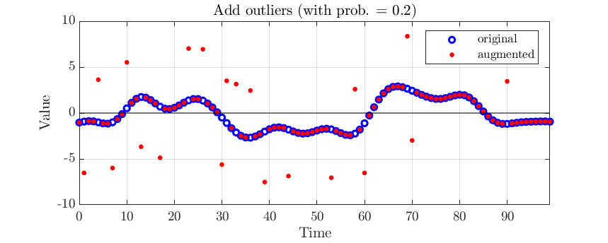
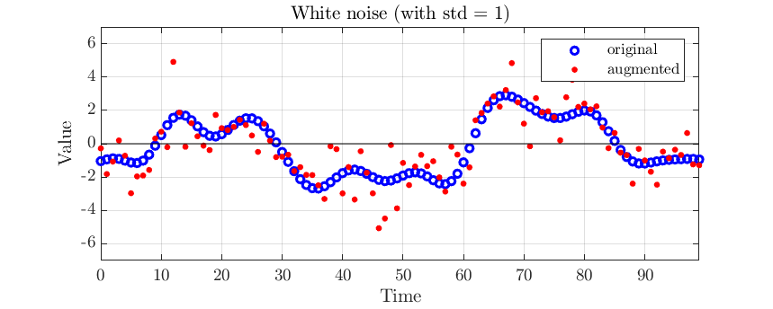
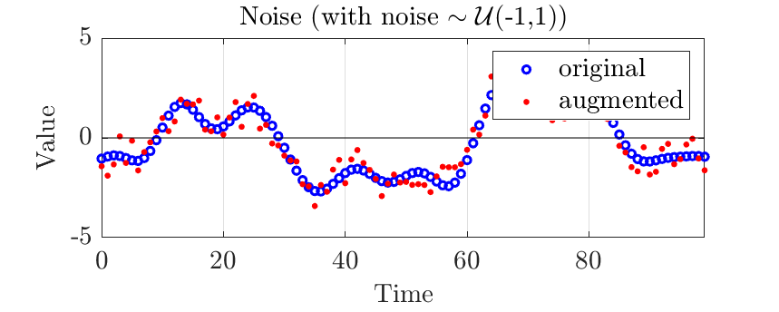
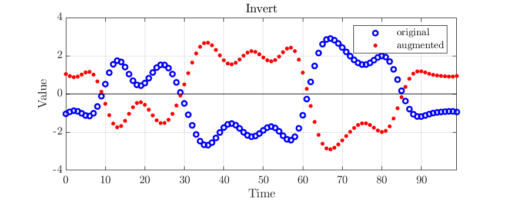
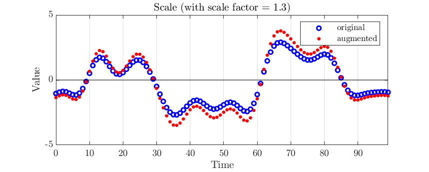
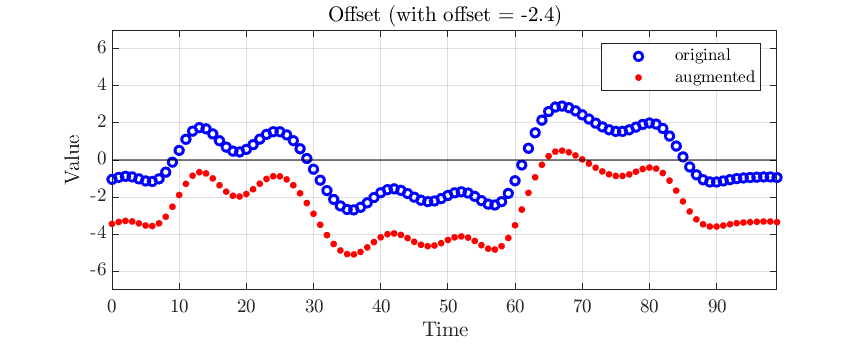
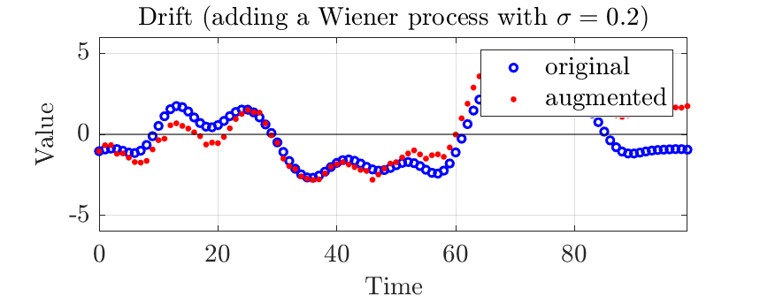
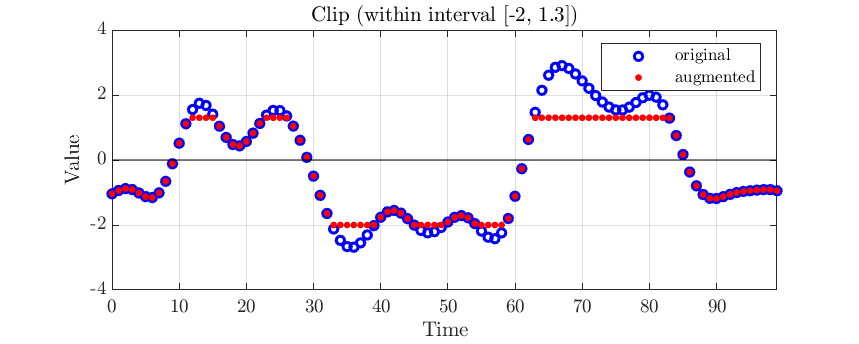
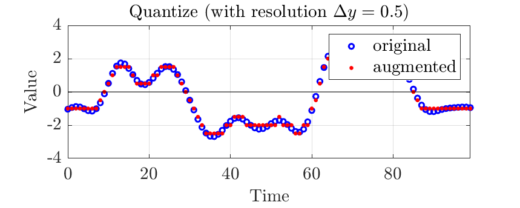
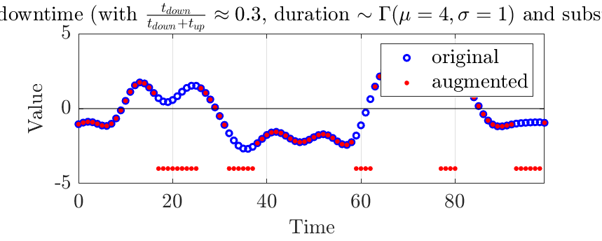

# List of time series augmentation methods

Abbreviations:
 - TS: Time series
 - dist.: Probability distribution
 - para: Parameter(s)
 - std.: standard deviation
 - estd(s/p): empirical standard deviation of series or panel data
 - A &prop; B: Term A is proportional to term B.  

| Effected TS property | Augmentor Name | &nbsp;&nbsp;&nbsp;&nbsp;&nbsp;&nbsp;&nbsp;&nbsp;&nbsp;&nbsp;&nbsp;&nbsp;&nbsp;&nbsp;&nbsp;&nbsp;&nbsp;&nbsp;&nbsp;&nbsp;&nbsp;&nbsp;&nbsp;&nbsp;&nbsp;&nbsp;&nbsp;Example&nbsp;(click&nbsp;to&nbsp;enlarge)&nbsp;&nbsp;&nbsp;&nbsp;&nbsp;&nbsp;&nbsp;&nbsp;&nbsp;&nbsp;&nbsp;&nbsp;&nbsp;&nbsp;&nbsp;&nbsp;&nbsp;&nbsp;&nbsp;&nbsp;&nbsp;&nbsp;&nbsp; | &nbsp;&nbsp;&nbsp;&nbsp;&nbsp;&nbsp;&nbsp;&nbsp;&nbsp;&nbsp;&nbsp;&nbsp;&nbsp;&nbsp;&nbsp;&nbsp;Short&nbsp;description&nbsp;&nbsp;&nbsp;&nbsp;&nbsp;&nbsp;&nbsp;&nbsp;&nbsp;&nbsp;&nbsp;&nbsp;&nbsp;&nbsp;&nbsp;&nbsp; | &nbsp;&nbsp;&nbsp;&nbsp;&nbsp;&nbsp;&nbsp;&nbsp;&nbsp;Parameters&nbsp;&nbsp;&nbsp;&nbsp;&nbsp;&nbsp;&nbsp;&nbsp;&nbsp; | No. of para. | Fittable&nbsp;Param.&nbsp;to series / panel? | reversible | random | changing TS length | Sources |
| :-- | :-- | :---: | :-------------- | :------- | :--: | :--- | :------: | :--: | :--------------: | :-- |
|value|Outliers|Augmenter adds outliers using a Bernoulli process and substitutes the affected samples by user defined values.|p, substitute|2|outlier dist. scale &prop; estd(s/p)|no|yes|no|| |
|value|WhiteNoise|Augmenter adding Gaussian (i.e. white) noise to each time series.|std. of noise|1|std of noise &prop; estd(s/p)|no|yes|no|| |
|value|Noise| |noise distribution description|dep.|dist. scale para. &prop; estd(s/p)|no|yes|no|| |
|value|Invert|Augmenter inverting the time series (i.e. multiply each value with -1).|-|0|-|yes|no|no|| |
|value|Scale|Augmenter scaling the time series by a constant factor.|scale factor|1|scale factor|yes|no|no|| |
|value|Offset|Augmenter adding a constant offset to the time series.|offset|1|yes|no|no|| |
|value|Drift|Augmenter adding a random Wiener Process to time series.|standard deviation of Wiener process|1|no|yes|no|| |
|value|Clip|Augmenter clipping the time series between definable min and max values.|min, max|2|no|no|no|| |
|value|Quantize|Augmenter quantizes time series (down) to defined resolution.|resolution increment|1|no|no|no|| |
|value|RandomDowntime| |downtime percentage, mean and standard deviation of a downtime's duration, substitute|4|no|yes|no|| |
