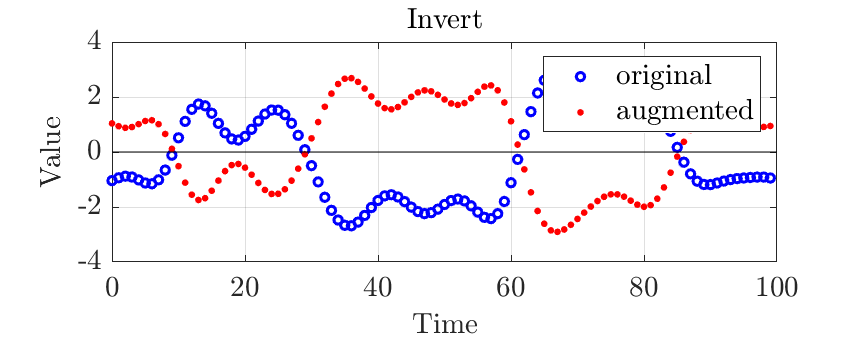

# List of time series augmentation methods

Abbreviations:
 - TS: Time series
 - dist.: Probability distribution
 - para: Parameter(s)
 - std.: standard deviation
 - estd(s/p) / emean(s/p): empirical standard deviation / mean of series or panel data
 - A &prop; B: Term A is proportional to term B.
 - A &sim; B: Random variable A's distribution is given by distribution B.

## 1: Value axis effecting augmentation methods

| Augmentor Name | &nbsp;&nbsp;&nbsp;&nbsp;&nbsp;&nbsp;&nbsp;&nbsp;&nbsp;&nbsp;&nbsp;&nbsp;&nbsp;&nbsp;&nbsp;&nbsp;&nbsp;Example&nbsp;(click&nbsp;to&nbsp;enlarge)&nbsp;&nbsp;&nbsp;&nbsp;&nbsp;&nbsp;&nbsp;&nbsp;&nbsp;&nbsp;&nbsp;&nbsp;&nbsp; | &nbsp;&nbsp;&nbsp;&nbsp;&nbsp;&nbsp;&nbsp;&nbsp;&nbsp;&nbsp;&nbsp;&nbsp;&nbsp;&nbsp;&nbsp;&nbsp;Short&nbsp;description&nbsp;&nbsp;&nbsp;&nbsp;&nbsp;&nbsp;&nbsp;&nbsp;&nbsp;&nbsp;&nbsp;&nbsp;&nbsp;&nbsp;&nbsp;&nbsp; | &nbsp;&nbsp;&nbsp;&nbsp;&nbsp;&nbsp;&nbsp;&nbsp;&nbsp;Parameters&nbsp;&nbsp;&nbsp;&nbsp;&nbsp;&nbsp;&nbsp;&nbsp;&nbsp; | No. of para. | Fittable&nbsp;Param.&nbsp;to series / panel? | reversible | random | changing TS length | Sources |
| :-- | :---: | :-------------- | :------- | :--: | :--- | :------: | :--: | :--------------: | :-- |
|Outliers||Augmenter adds outliers using a Bernoulli process and substitutes the affected samples by user defined values/dist.|p, substitute value / dist.|2|outlier dist. scale &prop; estd(s/p)|no|yes|no| |
|WhiteNoise||Augmenter adding Gaussian (i.e. white) noise to each TS.|std. of noise|1|std of noise &prop; estd(s/p)|no|yes|no| |
|Noise|| Augmeter adding any user defined noise dist. to TS.|noise distribution description|dep.|dist. scale para. &prop; estd(s/p)|no|yes|no| |
|Invert||Augmenter inverting the TS (i.e. multiply each value with -1).|-|0|-|yes|no|no| |
|Scale||Augmenter scaling the TS by a constant factor.|scale factor|1|scale factor &prop; estd(s/p)|yes|no|no| |
|Offset||Augmenter adding a constant offset to the TS.|offset|1|offset &prop; emean(s/p)|yes|no|no| |
|Drift||Augmenter adding a random Wiener Process to TS.|std. of Wiener process|1|std of Wiener &prop; estd(s/p)|no|yes|no| |
|Clip||Augmenter clipping the TS between definable min and max values.|min, max|2|min, max &prop; quantile(s/p)|no|no|no| |
|Quantize||Augmenter quantizes TS (down) to defined resolution.|resolution increment|1|resolution increment &prop; estd(s/p)|no|no|no| |
|RandomDowntime|| Augmenter simulating user defined sampling failures by substituting or erasing the effected TS samples. |downtime percentage, mean and std. of a downtime's duration, substitute|4|-|no|yes|no| |

## 2: Time axis effecting augmentation methods

| Augmentor Name | &nbsp;&nbsp;&nbsp;&nbsp;&nbsp;&nbsp;&nbsp;&nbsp;&nbsp;&nbsp;&nbsp;&nbsp;&nbsp;&nbsp;&nbsp;&nbsp;&nbsp;Example&nbsp;(click&nbsp;to&nbsp;enlarge)&nbsp;&nbsp;&nbsp;&nbsp;&nbsp;&nbsp;&nbsp;&nbsp;&nbsp;&nbsp;&nbsp;&nbsp;&nbsp; | &nbsp;&nbsp;&nbsp;&nbsp;&nbsp;&nbsp;&nbsp;&nbsp;&nbsp;&nbsp;&nbsp;&nbsp;&nbsp;&nbsp;&nbsp;&nbsp;Short&nbsp;description&nbsp;&nbsp;&nbsp;&nbsp;&nbsp;&nbsp;&nbsp;&nbsp;&nbsp;&nbsp;&nbsp;&nbsp;&nbsp;&nbsp;&nbsp;&nbsp; | &nbsp;&nbsp;&nbsp;&nbsp;&nbsp;&nbsp;&nbsp;&nbsp;&nbsp;Parameters&nbsp;&nbsp;&nbsp;&nbsp;&nbsp;&nbsp;&nbsp;&nbsp;&nbsp; | No. of para. | Fittable&nbsp;Param.&nbsp;to series / panel? | reversible | random | changing TS length | Sources |
| :-- | :---: | :-------------- | :------- | :--: | :--- | :------: | :--: | :--------------: | :-- |
|Reverse|| desc | para | no. | fittable | rev. | rand. | length | sources |
|ClipTime|| desc | para | no. | fittable | rev. | rand. | length | sources |
|Jitter|| desc | para | no. | fittable | rev. | rand. | length | sources |
|Resample|| desc | para | no. | fittable | rev. | rand. | length | sources |
|ScaleTime|| desc | para | no. | fittable | rev. | rand. | length | sources |
|OffsetTime|| desc | para | no. | fittable | rev. | rand. | length | sources |
|RandomTimeWarp|| desc | para | no. | fittable | rev. | rand. | length | sources |

## 3: Rearranging augmentation methods

| Augmentor Name | &nbsp;&nbsp;&nbsp;&nbsp;&nbsp;&nbsp;&nbsp;&nbsp;&nbsp;&nbsp;&nbsp;&nbsp;&nbsp;&nbsp;&nbsp;&nbsp;&nbsp;Example&nbsp;(click&nbsp;to&nbsp;enlarge)&nbsp;&nbsp;&nbsp;&nbsp;&nbsp;&nbsp;&nbsp;&nbsp;&nbsp;&nbsp;&nbsp;&nbsp;&nbsp; | &nbsp;&nbsp;&nbsp;&nbsp;&nbsp;&nbsp;&nbsp;&nbsp;&nbsp;&nbsp;&nbsp;&nbsp;&nbsp;&nbsp;&nbsp;&nbsp;Short&nbsp;description&nbsp;&nbsp;&nbsp;&nbsp;&nbsp;&nbsp;&nbsp;&nbsp;&nbsp;&nbsp;&nbsp;&nbsp;&nbsp;&nbsp;&nbsp;&nbsp; | &nbsp;&nbsp;&nbsp;&nbsp;&nbsp;&nbsp;&nbsp;&nbsp;&nbsp;Parameters&nbsp;&nbsp;&nbsp;&nbsp;&nbsp;&nbsp;&nbsp;&nbsp;&nbsp; | No. of para. | Fittable&nbsp;Param.&nbsp;to series / panel? | reversible | random | changing TS length | Sources |
| :-- | :---: | :-------------- | :------- | :--: | :--- | :------: | :--: | :--------------: | :-- |
|Chop| img | desc | para | no. | fittable | rev. | rand. | length | sources |
|JigsawSeries| img | desc | para | no. | fittable | rev. | rand. | length | sources |
|JigsawPanel| img | desc | para | no. | fittable | rev. | rand. | length | sources |
|Pooling| img | desc | para | no. | fittable | rev. | rand. | length | sources |
|BlendPanel| img | desc | para | no. | fittable | rev. | rand. | length | sources |
|ShuffleSeries| img | desc | para | no. | fittable | rev. | rand. | length | sources |

## 4: Frequency effecting augmentation methods

| Augmentor Name | &nbsp;&nbsp;&nbsp;&nbsp;&nbsp;&nbsp;&nbsp;&nbsp;&nbsp;&nbsp;&nbsp;&nbsp;&nbsp;&nbsp;&nbsp;&nbsp;&nbsp;Example&nbsp;(click&nbsp;to&nbsp;enlarge)&nbsp;&nbsp;&nbsp;&nbsp;&nbsp;&nbsp;&nbsp;&nbsp;&nbsp;&nbsp;&nbsp;&nbsp;&nbsp; | &nbsp;&nbsp;&nbsp;&nbsp;&nbsp;&nbsp;&nbsp;&nbsp;&nbsp;&nbsp;&nbsp;&nbsp;&nbsp;&nbsp;&nbsp;&nbsp;Short&nbsp;description&nbsp;&nbsp;&nbsp;&nbsp;&nbsp;&nbsp;&nbsp;&nbsp;&nbsp;&nbsp;&nbsp;&nbsp;&nbsp;&nbsp;&nbsp;&nbsp; | &nbsp;&nbsp;&nbsp;&nbsp;&nbsp;&nbsp;&nbsp;&nbsp;&nbsp;Parameters&nbsp;&nbsp;&nbsp;&nbsp;&nbsp;&nbsp;&nbsp;&nbsp;&nbsp; | No. of para. | Fittable&nbsp;Param.&nbsp;to series / panel? | reversible | random | changing TS length | Sources |
| :-- | :---: | :-------------- | :------- | :--: | :--- | :------: | :--: | :--------------: | :-- |
|FrequencyFilter| img | desc | para | no. | fittable | rev. | rand. | length | sources |
|LowPassFilter| img | desc | para | no. | fittable | rev. | rand. | length | sources |
|HighPassFilter| img | desc | para | no. | fittable | rev. | rand. | length | sources |
|BandStopFilter| img | desc | para | no. | fittable | rev. | rand. | length | sources |
|BandPassFilter| img | desc | para | no. | fittable | rev. | rand. | length | sources |
|RandomFFTPhase| img | desc | para | no. | fittable | rev. | rand. | length | sources |
|FFTPhaseAddNoise| img | desc | para | no. | fittable | rev. | rand. | length | sources |
|FFTPhaseDrift| img | desc | para | no. | fittable | rev. | rand. | length | sources |
|PitchOffset| img | desc | para | no. | fittable | rev. | rand. | length | sources |

